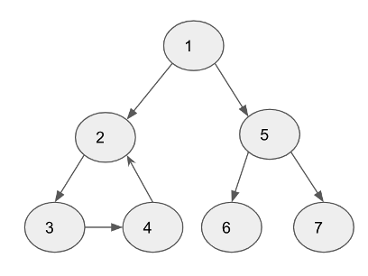
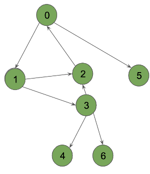

# HW6 EE599 - Computing Principles for Electrical Engineers

- Please clone the repository, edit [README.md](README.md) to answer the questions, and fill up functions to finish the hw.
- For non-coding questions, you will find **Answer** below each question. Please write your answer there.
- For coding questions, please make sure that your code can run ```bazel run/test```. In this homework, you will need to fill up [cpplib.cc](src/lib/cpplib.cc) and tests in [tests](tests).
- For coding questions, there is a **black box** testing for each question. All points are only based on passing the test cases or not (i.e. we don't grade your work by your source code). So, try to do comprehensive testing before your final submission.

- For submission, please push your answers to Github before the deadline.
- Deadline: Fri, Nov 13th 2020 by 06:30 pm
- Total: 120 points. 100 points is considered full credit.

## Question 1 (30 pints, Medium)

There are a total of numCourses courses you have to take, labeled from 0 to numCourses-1.
Some courses may have prerequisites, for example to take course 0 you have to first take course 1, which is expressed as a pair: [0,1]
Given the total number of courses and a list of prerequisite pairs, if it is possible for you to finish all courses return true else return false.

Hint: This question could be solved by topological sort or checking whether there is a loop inside the graph.

```c++
bool canFinish(int numCourses, std::vector<std::pair<int, int>> &prerequisites)
```
2 courses, take course 1 you have to first take course 0 \
Input: 2, [[1,0]] \
Output: true

2 courses, take course 1 you have to first take course 0, and take course 0 you have to first take course 1 \
Input: 2, [[1,0], [0,1]] \
Output: false

## Question 2 (30 points. Medium - Hard)

Given a directed graph, find out if it contains a cycle.
Your task is to write the following three functions:

- ReachesACycle
- HasCycle
- ResetStatus
We use following code to represent graph node.

```c++
enum class NodeStatus {
  NotVisited,
  Visiting,
  Visited
};

struct GraphNode {
 int node_number;
 NodeStatus status;
 std::vector<GraphNode *> children;
 GraphNode(int n) : node_number(n) {
   status = NodeStatus::NotVisited;
  }
};
```

The graph is implemented using the following code:

```c++
class PointerGraph {
public:
 PointerGraph() {}

 // Returns true if a cycle is reachable from start_node
 bool ReachesACycle(GraphNode *start_node);

 // Returns true if the graph has a cycle
 bool HasCycle();

 // Resets the status of all nodes to NodeStatus::NotVisited
 void ResetStatus();
 std::vector<GraphNode *> _nodes;
};
```

Here are few examples:
Example 1

- Input:

<p align="center"></p>

- Output: ```ReachesACycle``` for node 1 returns true. ```ReachesACycle``` for node 5 returns false. ```HasCycle``` returns true.

Example 2

- Input:

<p align="center"></p>

- Output: ```ReachesACycle``` for node 0 returns true. ```ReachesACycle``` for node 4 returns false. ```HasCycle``` returns true.

Write several tests using GTest for your function in tests/q2_student_test.cc, and run the following command to verify the functionality of your program.

```shell
bazel test tests:q2_student_test
```

## Question 3 (20 points. Medium)

Consider the following representation of a graph using an std::map that maps each vertex to its neighbors, and the sample usage of it:

```cpp
class​ ​Graph​ {
  public:
​  Graph​(std::​map​<​int​, std::s​ et​<​int​>> ​&​vertices​) : v_(vertices) {}
  std::map<​int​, std::set<​int​>> v_;
};

int​ ​main​() {
  std::map<​int​, std::set<​int​>> vertices{
    {​1​, {​2​, ​3​}},
    {​2​, {​1​, ​3​, ​4​, ​5​}}, {​3​, {​1​, ​2​, ​4​}}, {​4​, {​2​, 3, ​4​}}
    };
  Graph ​g​(vertices);
}
```

- Add a new method to this class to implement the **​non-recursive version​ of D​FS algorithm**.
- Your function should take a vertex called root as the starting point, and should output a vector containing the nodes that it visits in DFS order.

Write several tests using GTest for your function in tests/q3_student_test.cc, and run the following command to verify the functionality of your program.

```shell
bazel test tests:q3_student_test
```

## Question 4 (20 points. Medium)

Given a linked list, write a function ```void sortList()``` that sorts the linked list using selection sort.

Note:

- You must use selection sort rather than other sorting algorithm
- Please use the linked list you created in hw3 rather than bulit-in list

Example:\
input: 2->1->0->5\
After sorting: 0->1->2->5

Write several tests using GTest for your function in tests/q4_student_test.cc, and run the following command to verify the functionality of your program.

```shell
bazel test tests:q4_student_test
```

## Question 5 (20 points. Medium - Hard)

Given a graph with known node name and their pair connectivity, write a function ```std::vector<char> ShortestPath(std::vector<char> &vertices, std::vector<std::pair<char, char>> &edges, char node_1, char node_2)```that returns the path with shortest distance between two nodes `node_1` and `node_2`. If two nodes are not connected, return an empty vector. If two nodes have multiple shortest shortest paths, return one of the paths would be OK.

```
Example:
vertices = {'A','B','C','D','E','F','G'};
edges = { {'A','B'},
          {'A','C'},
          {'B','C'},
          {'B','E'},
          {'C','E'},
          {'E','F'},
          {'D','F'}
        };

Expected result:
shortest path of 'A' and 'B' is {'A', 'B'},
shortest path of 'A' and 'E' is either {'A','C',E'} or {'A','B','E'},
shortest path of 'A' and 'G' is {}.
```

- Hint: Can you implement your algorithm with time complexity O(|V|+|E|)?

Write several tests using GTest for your function in tests/q5_student_test.cc, and run the following command to verify the functionality of your program.

```shell
bazel test tests:q5_student_test
```
